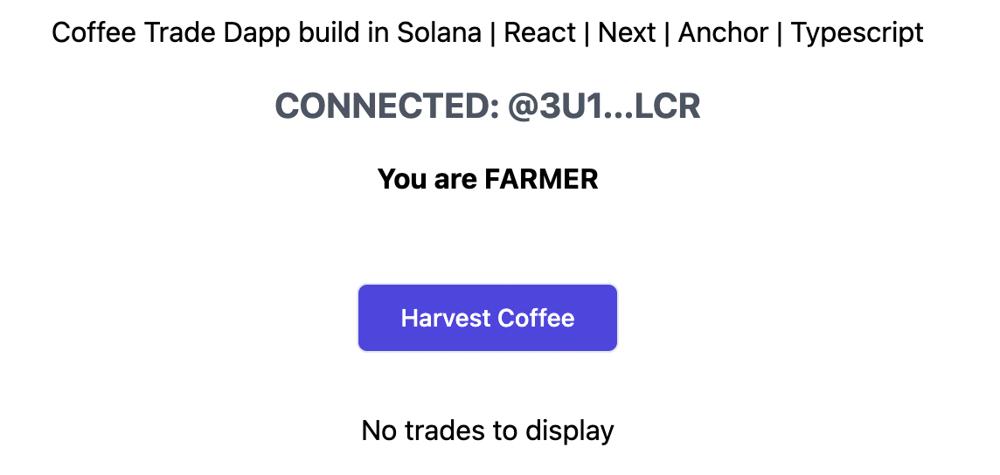

# Solana Fair Trade Coffee dApp
Dapp for Tracking coffee items through the Supply Chain and improving traceability of a coffee bean, from farm to consumer
Coffee items are monitored by their status (harvested, processed, for sale, sold, packed, shipped). User's rights depend on their role (Farmer, Retailer and Consumer).

Coffee trades status thought supply chain
| #1        | #2        | #3        | #4        | #5          | #6           | #7          |
| :--------:| :--------:|:--------: | :--------:| :--------:  | :--------:   | :--------:  |
| harvested | processed | for sale  | sold      | sold        | packed       | shipped     |

Coffee Item Status | User who ie eligible to change the Status
------------------ | ------------------
harvested          | farmer
processed          | farmer
for sale           | retailer
sold               | customer
packed             | retailer
shipped            | retailer

## Getting Started
The app was built using Anchor [Anchor](https://project-serum.github.io/anchor/getting-started/introduction.html).<br />
The frontend was built using [Next.js](https://nextjs.org/)](https://nextjs.org/) project bootstrapped with [`create-next-app`](https://github.com/vercel/next.js/tree/canary/packages/create-next-app).<br />
Download Phantom wallet in your Browser extension [here](https://phantom.app/download).<br />
Change wallet network to `devnet`.<br />

## Installation
The app was built on `devnet` network
```bash
anchor build
#and
anchor deploy
```

## Run the client

```bash
cd app
```
## Run the development server

```bash
yarn & yarn dev
#or
npm install && npm run dev
```
Open [http://localhost:3000](http://localhost:3000) with your browser to see the result.

## Generate account key
This command will generate two keypair: `initAccount-keypair.json` & genesis account-keypair.json`

```bash
yarn keygen
#or
npm run keygen
```

Select User role


Init new contract


To `harvest` contract and then `processed` , you need to be a farmer. Then to mark the item as `for sale` you need to retailer
